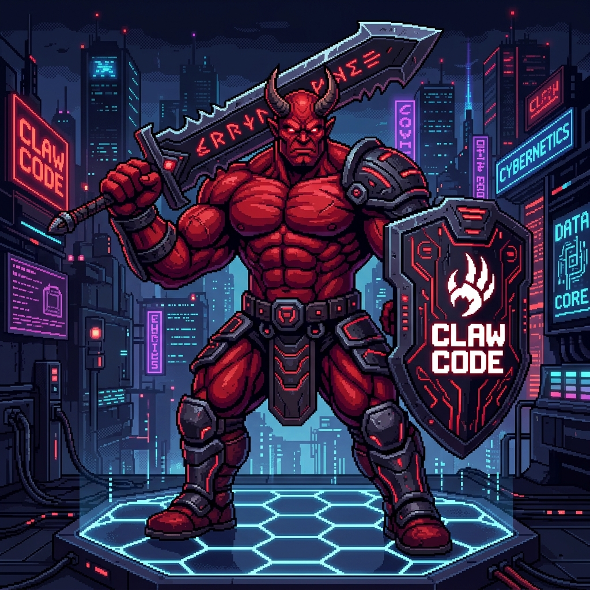

# Claw Security (ClawSec)
<div align="center">
  
</div>

Claw Security is an autonomous AI-driven penetration testing harness built in Rust. Designed as a high-performance, model-agnostic red-teaming engine, ClawSec integrates large language models into active security workflows to automate network enumeration, vulnerability scanning, and exploit validation.

## The Vision

The cybersecurity industry requires scalable, intelligent automation. While the original [Claw Code](https://github.com/ultraworkers/claw-code) set the standard for autonomous developer agents, ClawSec adapts this core architecture specifically for offensive security.

Our objective is to provide the security community with a transparent, robust environment where foundation models can map attack surfaces, correlate vulnerability data, and execute complex toolchains under strict human oversight and role-based boundaries.

## Architecture & Subagents

ClawSec uses a strict role-based delegation model to segment high-risk tasks and prevent unintended execution loops.

| Role | Operational Scope | Authorized Toolset |
|---|---|---|
| **Recon** | Target fingerprinting, intelligence gathering, and port enumeration. | `RunNmap`, `read_file`, `WebFetch`, `grep_search`, `ToolSearch` |
| **VulnScanner** | Parsing exploit databases, correlating CVEs, and determining attack vectors. | `RunNmap`, `RunExploitScript`, `bash`, `StructuredOutput` |
| **Exploitation** | Live execution of exploit scripts and chaining targeted payloads. | `RunExploitScript`, `bash`, `PowerShell`, `REPL` |

*Note: The `Recon` agent is deliberately restricted from `bash` access to enforce strict role isolation during initial discovery phases.*

## Security-Centric Tooling

ClawSec incorporates native tooling built for the penetration testing lifecycle, featuring output truncation and timeout handling to optimize context window performance.

### `RunNmap`
A native wrapper for the `nmap` mapper, allowing models to invoke specific diagnostic scan profiles against defined subnets.
- **Profiles:** `quick`, `full`, `vuln`, `stealth`, `services`, `udp`, `aggressive`, `os-detect`, `scripts`
- **Safeguards:** 300-second execution timeout and extensive stderr parsing.

### `RunExploitScript`
Manages the execution phase. As the agent authors payloads locally, this tool securely invokes them against the target environment.
- **Interpreters:** Transparent auto-detection for `python3`, `ruby`, `bash`, and `perl`.
- **Safeguards:** 120-second hard timeout to isolate and manage stalled script execution gracefully.

## Rules of Engagement (RoE)

ClawSec natively respects a `.clawsec/CLAWSEC.md` file (or `CLAWSEC.md` in root). 

Use this file to strictly define your **Rules of Engagement (RoE)**, out-of-bounds IPs, prohibited methodologies, or compliance restrictions. The primary agent ingests these parameters before every engagement to securely bind its tool execution paths. (See `template.CLAWSEC.md` in this repository for a definitive starting template).

## Core Use Cases

ClawSec is designed to automate the repetitive tasks of initial discovery and validate vulnerabilities efficiently.

* **Automated Attack Surface Mapping:** Deploy headless scans against broad subnets. The agent autonomously executes Nmap, parses raw outputs, categorizes service versions, and identifies potential weak points.
* **Rapid Exploit Prototyping:** When a vulnerability is identified, the Exploitation subagent functions as an active assistant. It can generate local exploit scripts, execute them, evaluate stdout/stderr results, and dynamically adjust its payload if the initial vector fails.
* **Continuous Defensive Validation:** DevOps teams can deploy ClawSec within CI/CD pipelines. By restricting the `CLAWSEC.md` configurations to read-only audits, staging environments can undergo continuous security assessments before production.

## Operational Limitations

To integrate ClawSec effectively, operators must account for its current boundaries:

* **Foundation Model Bounds:** The agent's tactical capability directly correlates to the knowledge base of the supplied LLM. It excels at chaining established CVEs and exposing misconfigurations, but it will not invent novel undocumented Zero-Days.
* **Logic Loops:** While internal tools implement rigid execution timeouts (e.g., 120-second caps on exploit execution), complex payloads may occasionally cause the LLM to enter troubleshooting loops. It operates best with human oversight during critical phases.
* **Host Toolchain Dependencies:** ClawSec natively relies on the host operating system's binaries. If the deployment environment lacks specific security frameworks, the agent will gracefully fail to execute them. 
* **Airgap Constraints:** Relying on commercial models requires outbound API connections. For air-gapped engagements, the host must bind an `OPENAI_BASE_URL` to a local model (e.g., LLaMA-3), which may impact analytical performance compared to frontier models.

## Model Independence

Claw Security relies on open standards and is entirely decoupled from any specific LLM provider.

* **Anthropic:** Claude 4.6 Opus (Default Configuration) / 4.5 Sonnet
* **Google:** Gemini 3.1 Pro / 2.5 Flash
* **Local / Offline:** LLaMA-4, DeepSeek-V3, or Mixtral via the `OPENAI_BASE_URL` standard mapping.
* **xAI:** Grok 3 series models

API keys are managed natively via environment variables (`ANTHROPIC_API_KEY`, etc.).

## Installation & Quickstart

To compile and launch ClawSec, you need a standard Rust toolchain alongside standard security utilities (`nmap`, `python3`, `bash`) accessible within your path.

### 1. Build from Source
```bash
git clone https://github.com/enabled404/ClawSec.git
cd ClawSec/rust
cargo build --release -p claw-cli
```

### 2. Configure the Environment
```bash
export ANTHROPIC_API_KEY="sk-ant-..."
# Set up optional OAuth tokens
target/release/claw login
```

### 3. Launch an Audit
Deploy an autonomous audit from the interactive REPL:
```bash
target/release/claw
> Run a stealth port scan against 10.0.0.5, identify active CVEs on exposed web services, and attempt a remote exploitation chain.
```

Execute a headless verification scan directly:
```bash
target/release/claw prompt "scan 192.168.1.0/24 for unauthenticated services"
```

## Advanced Usage

Bind the process to a specific foundation model:
```bash
target/release/claw --model gemini "enumerate active directories at 10.0.0.22"
```

Inspect active security tooling and loaded configurations:
```bash
target/release/claw tools
target/release/claw config
```

*For a full list of commands and execution flags, type `/help` natively within the local REPL.*

## Extensibility & Contributing

Claw Security is built to expand. We invite researchers to build and contribute new Model Context Protocol (MCP) servers integrating Metasploit, Nessus, SQLmap, and Active Directory enumeration tools directly into the ClawSec ecosystem. 

Review [`CONTRIBUTING.md`](CONTRIBUTING.md) to get involved.

## Legal Disclaimer & Terms of Use

**Claw Security (ClawSec) is designed strictly for educational purposes, authorized security research, and legal penetration testing.**

By downloading, installing, or using this software, you explicitly agree to the following terms:

1. **Authorized Use Only:** You will only use ClawSec on networks, systems, and applications for which you have explicit, written, and legally binding authorization to assess.
2. **No Liability:** The creator of this software and any contributors to this repository take zero responsibility for any damages, legal repercussions, or unauthorized access resulting from the use or misuse of this engine. 
3. **User Responsibility:** You operate this autonomous framework at your own risk. The tool is capable of executing live exploits and interacting with host filesystems. You are solely responsible for ensuring that its execution remains strictly within your authorized scope of engagement.

Do not use this tool for malicious activity.
